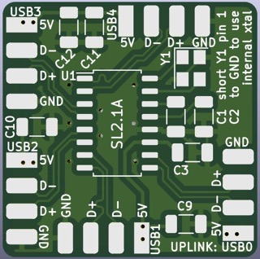
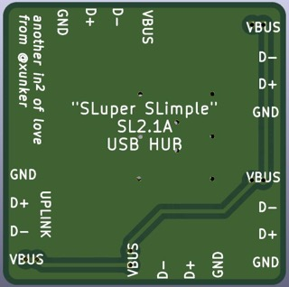
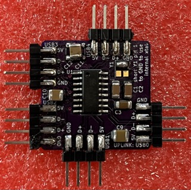
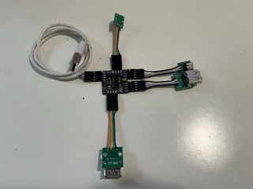

# "SLuper SLimple" SL2.1A USB 2.0 Hub

A 4-port USB 2.0 hub on a 1-inch (25.4mm) square board. Utilizes the
(hand-solderable) SL2.1A USB Hub Controller with footprint for an optional
crystal oscillator. Features length-matched data lines for maximum
potato-performance.

Uses only surface-mount components and, except for the IC and (optional)
crystal, all of them can be found in your parts bin or scavenged from other
equipment.

The PCB can be hand-etched on a single-sized PCB, as long as jumper wires are
added to connect all the 5V pins for the USB connections.

[](images/preview_front.jpg)[](images/preview_back.jpg)

[](images/pcb_assembled.jpg)[](images/pcb_with_connectors.jpg)

## Bill of Materials

* The PCB itself
* **U1**: SL2.1A, SOIC-16 package
* **Y1**: 12Mhz crystal Oscillator, 3225 4-pin package
  - optional but recommended
* **C1**, **C2**: 10uF ceramic capacitor, 1206 package
  * quantity: 2
  * should be rated for 6V or higher
* **C9**, **C10**, **C11**, **C12**: 100uF ceramic capacitor, 1206 package
  * quantity 4
  * should be rated for 10V or higher
  * C11/C12 can share a common capacitor attached between the
    pads if you only have 3 on hand
* **USB0**, **USB1**, **USB2**, **USB3**, **USB4**: 2.54mm 1x4 breakaway headers
  * quantity: 5
  * optional, you can solder USB connections directly to the pads if you wish

### Sourcing USB Connectors

This BoM does not include the actual USB upstream and downstream connectors
themselves.

In my case, I used a handful of USB connector breakouts (search for
"usb-a breakout" on your marketplace of choice) for the downstream connectors,
and cut up an old USB cable for the upstream (USB0) connector.

You could also cut up a few USB-A-F to USB-A-M extensions instead and solder the
ends directly to the pads if you want them to be permanent.

## Hand-Solder Construction Order

Because space on this board is limited, it is recommended to solder the
components in this order if you are soldering by hand using an iron.

1. Y1 (optional, but will be hard to solder after capacitors are in place)
    * If you choose to skip the external crystal, you must connect pin 1 of Y1
      to GND
    * Pin 1 is the pad closest to the silkscreened "Y1"
2. U1
3. C1
4. C2
5. C3
6. C9
7. ..remaining components in any order

## SL2.1A Information

A [translated datasheet](./corechips-sl2-1a_usb_hub_controller_datasheet_translated.pdf) is provided in this repo.

If your hub is functioning correctly, this is the USB information you should be
able to see when connected:

```
Reporting name: USB2.0 HUB
Product ID:     0x0101
Vendor ID:      0x1a40  (TERMINUS TECHNOLOGY INC.)
Version:        1.00
Speed:          Up to 480 Mb/s

Current Available (mA):       500
Current Required (mA):        100
Extra Operating Current (mA):	0
```

Information may vary depending in the version of the IC you have.

# Changelog

### Initial Revision - Sept 2024

First working version from fab.

# Repository

The canonical repository is https://github.com/xunker/simple_sl2.1a_usb_hub

For the license, see [LICENSE](./LICENSE).